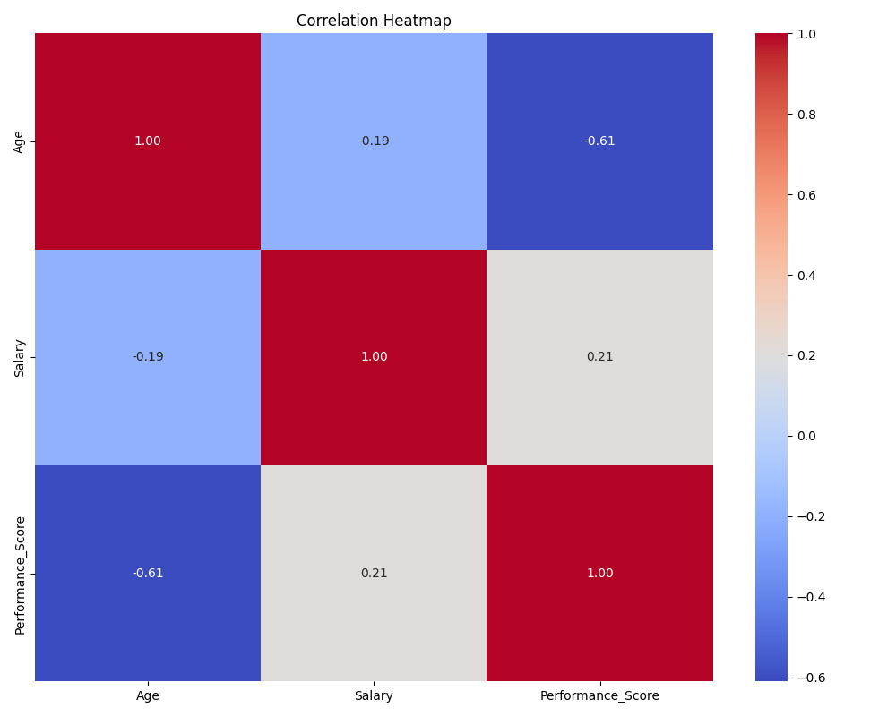

# 📊 Dataset Summary Report

**Total Rows:** 11

**Total Columns:** 8

## 🔎 Column Summary

### ➤ Name
- **Type**: object
- **Missing Values**: 0 (0.00%)
- **Unique Values**: 11
- **Top Categories**: {'alice': 1, 'bob': 1, 'charlie': 1}

### ➤ Age
- **Type**: float64
- **Missing Values**: 0 (0.00%)
- **Unique Values**: 11
- **Mean**: 33.23
- **Median**: 31.50
- **Std Dev**: 5.72

### ➤ Gender
- **Type**: object
- **Missing Values**: 0 (0.00%)
- **Unique Values**: 2
- **Top Categories**: {'male': 6, 'female': 5}

### ➤ Department
- **Type**: object
- **Missing Values**: 0 (0.00%)
- **Unique Values**: 5
- **Top Categories**: {'engineering': 5, 'sales': 2, 'marketing': 2}

### ➤ Salary
- **Type**: float64
- **Missing Values**: 0 (0.00%)
- **Unique Values**: 11
- **Mean**: 72681.82
- **Median**: 73500.00
- **Std Dev**: 15430.93

### ➤ Joining_Date
- **Type**: datetime64[ns]
- **Missing Values**: 0 (0.00%)
- **Unique Values**: 11
- Stats not available for non-numeric column.

### ➤ Performance_Score
- **Type**: float64
- **Missing Values**: 0 (0.00%)
- **Unique Values**: 11
- **Mean**: 4.26
- **Median**: 4.25
- **Std Dev**: 0.41

### ➤ Left_Company
- **Type**: object
- **Missing Values**: 0 (0.00%)
- **Unique Values**: 2
- **Top Categories**: {'no': 7, 'yes': 4}

## 🎯 Target-Based Insights

### Target: `alice`
- Rows: 1
- Avg values of numerical columns:
  - Age: 29.00
  - Salary: 85000.00
  - Performance_Score: 4.50

### Target: `bob`
- Rows: 1
- Avg values of numerical columns:
  - Age: 35.00
  - Salary: 55000.00
  - Performance_Score: 3.80

### Target: `charlie`
- Rows: 1
- Avg values of numerical columns:
  - Age: 28.00
  - Salary: 60000.00
  - Performance_Score: 4.20

### Target: `diana`
- Rows: 1
- Avg values of numerical columns:
  - Age: 40.00
  - Salary: 73500.00
  - Performance_Score: 4.70

### Target: `eve`
- Rows: 1
- Avg values of numerical columns:
  - Age: 32.00
  - Salary: 92000.00
  - Performance_Score: 4.25

### Target: `frank`
- Rows: 1
- Avg values of numerical columns:
  - Age: 45.00
  - Salary: 50000.00
  - Performance_Score: 3.50

### Target: `grace`
- Rows: 1
- Avg values of numerical columns:
  - Age: 30.00
  - Salary: 61000.00
  - Performance_Score: 4.60

### Target: `hank`
- Rows: 1
- Avg values of numerical columns:
  - Age: 38.00
  - Salary: 88000.00
  - Performance_Score: 4.00

### Target: `irene`
- Rows: 1
- Avg values of numerical columns:
  - Age: 26.00
  - Salary: 62000.00
  - Performance_Score: 4.90

### Target: `jack`
- Rows: 1
- Avg values of numerical columns:
  - Age: 31.00
  - Salary: 87000.00
  - Performance_Score: 4.30

### Target: `nan`
- Rows: 1
- Avg values of numerical columns:
  - Age: 31.50
  - Salary: 86000.00
  - Performance_Score: 4.10

## 🔥 Correlation Heatmap

✅ **Report Generated Successfully.**
